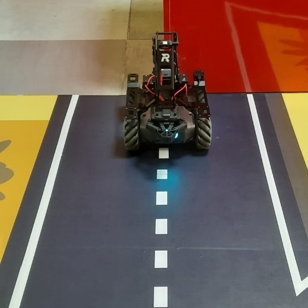
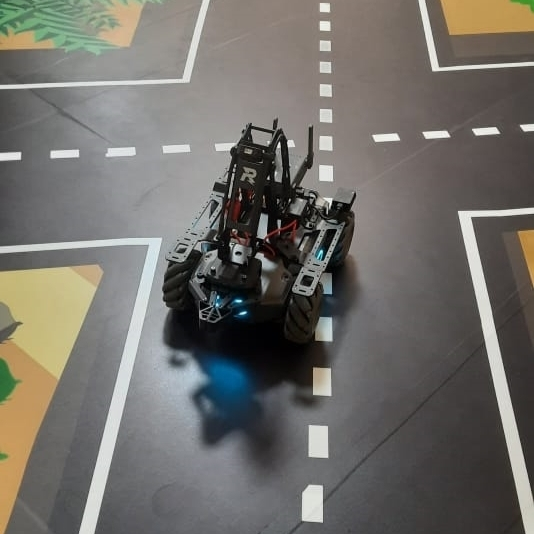

# MobileRobot-Openloopcontrol
## Aim:

To develop a python control code to move the mobilerobot along the predefined path.

## Equipments Required:
1. RoboMaster EP core
2. Python 3.7

## Procedure

Step 1:
Import robot from robomaster package.
<br/>

Step 2:
Configure the armored light of the robot.
Use the . operator to obtain the led object from the Robot() object.
<br/>

Step 3:
Obtain the chassis object .
ep_chassis = ep_robot.chassis
<br/>

Step 4:
Use the dirve_speed() method in the chassis object to control the speed of the chassis. 
<br/>

Step 5:
The x, y, and z parameters of the method represent the forward, lateral, and rotational speeds respectively.
<br/>
Step 6:
Use .close() to end.
ep_robot.close()

## Program
### Battery Code:
```
from robomaster import robot
import time

def sub_info_handler(batter_info, ep_robot):
    percent = batter_info
    print("Battery: {0}%.".format(percent))

if __name__ == '__main__':
    ep_robot = robot.Robot()
    ep_robot.initialize(conn_type="ap")

    ep_battery = ep_robot.battery

    ep_battery.sub_battery_info(5, sub_info_handler, ep_robot)
    time.sleep(10)
    ep_battery.unsub_battery_info()
    print("Completed ...")
    ep_robot.close()
```
### LED Code:
```
from robomaster import robot
import time


if __name__ == '__main__':
    ep_robot = robot.Robot()
    ep_robot.initialize(conn_type="ap")

    ep_led = ep_robot.led
    '''
    comp – enum: (“all”, “top_all”, “top_right”, “top_left”, “bottom_all”, “bottom_front”, “bottom_back”, “bottom_left”, “bottom_right”) lighting parts, all: all armor lights ;top_all: all armored lights of the gimbal; top_right: armored lights on the right side of the gimbal; top_left: armored lights on the left of the gimbal; bottom_all: all armored lights on the chassis; bottom_front: front armored lights; bottom_back: rear armored lights; bottom_left: left armored lights light; bottom_right: right armor light
    r – int: [0~255], RGB red component value
    g – int: [0~255], RGB green component value
    b – int: [0~255], RGB blue component value
    effect – enum: (“on”, “off”, “flash”, “breath”, “scrolling”) lighting effect type, on: always on; off: always off; flash: blinking; breath: breathing; scrolling: horse racing Lamp (only valid for PTZ lamp)
    '''
    for i in range(10):
        ep_led.set_led(comp="all",r=148,g=0,b=211,effect="on")   
        time.sleep(2)
        ep_led.set_led(comp="all",r=0,g=0,b=128,effect="on")
        time.sleep(2)
        ep_led.set_led(comp="all",r=0,g=255,b=255,effect="on")
        time.sleep(2)        
    
    print("Completed...")
    ep_robot.close()
```
### Circular Movement Code:
```
from robomaster import robot
import time

if __name__ == '__main__':
    ep_robot = robot.Robot()
    ep_robot.initialize(conn_type="ap")

    ep_chassis = ep_robot.chassis

    '''
    x = speed in x direction( meter/second) [-3.5,3.5]
    y = speed in y direction( meter/second) [-3.5,3.5]
    z = rotation about z axis ( degree/second)[-600,600]
    '''
    ep_chassis.drive_speed(x=0.2,y=0,z=20)
    time.sleep(20)
    ep_chassis.drive_speed(x=0,y=0,z=0)

    ep_robot.close()
```
### Linear Movement Code:
```
from robomaster import robot
import time

if __name__ == '__main__':
    ep_robot = robot.Robot()
    ep_robot.initialize(conn_type="ap")

    ep_chassis = ep_robot.chassis

    '''
    x = x-axis movement distance,( meters) [-5,5]
    y = y-axis movement distance,( meters) [-5,5]
    z = rotation about z axis ( degree)[-180,180]
    xy_speed = xy axis movement speed,( unit meter/second) [0.5,2]
    '''
    ep_chassis.move(x=2.7, y=0, z=0, xy_speed=0.75).wait_for_completed()

    ep_chassis.move(x=0, y=0, z=45, xy_speed=1).wait_for_completed()

    ep_chassis.move(x=3.5, y=0, z=0, xy_speed=0.75).wait_for_completed()
    ep_chassis.move(x=0, y=-0.5, z=0, xy_speed=0.75).wait_for_completed()

    ep_chassis.drive_speed(x=0.2,y=0,z=-10)
    time.sleep(20)
    ep_chassis.drive_speed(x=0,y=0,z=0)
    ep_chassis.move(x=0, y=0, z=30, xy_speed=0.75).wait_for_completed()
    ep_chassis.move(x=3, y=0, z=0, xy_speed=0.75).wait_for_completed()
    ep_robot.close()
```

## MobileRobot Movement Image:

### Starting Point of the Robot:


### Ending Point of the Robot:



<br/>


## MobileRobot Movement Video:

[](https://youtube.com/watch?v=Ljft3ANHLVw)

<br/>


## Result:
Thus the python program code is developed to move the mobilerobot in the predefined path.


<br/>

```
Mobile Robotics Laboratory
Department of Artificial Intelligence and Data Science/ Machine Learning
Saveetha Engineering College
```
